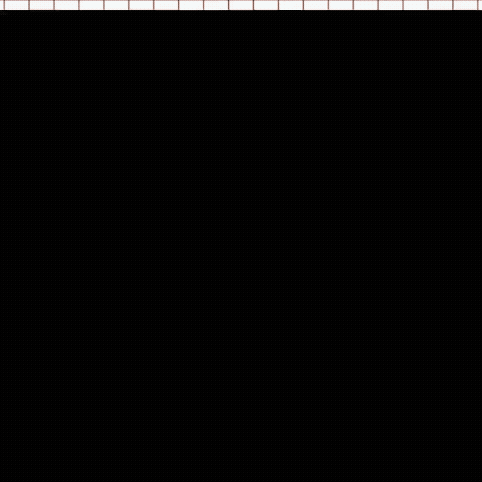

## Hi, I'm Amin Shazrin, <br/>A former UI/UX Engineer Specialist and a developer from Malaysia 🇲🇾.

[](https://github.com/ammein)
[](https://www.linkedin.com/in/amin-shazrin/)
[](mailto:aminshazrin@gmail.com)
[](https://www.npmjs.com/~ammein)
[](https://pypi.org/user/ammein/)
[](http://hits.dwyl.com/ammein/ammein)

### aminshazrin@personal ~ $ whoami

<!-- Any image aligned to the right. Beware the width -->


- 📚 I’m currently learning GLSL Applied Mathematics.
- 👨🏽‍🎨 I love transforming dreams into logical solutions.
- 🤝🏽 I don’t create complications; I simplify them.
- 🔫 I enjoy first-person shooter games.
- 🏸 Badminton is my hobby.
- 🤔 I’m looking for someone who is an expert in mathematics to collaborate with on a UI interactivity side quest.
- 📫 You can reach me at: aminshazrin@gmail.com
<details>
      <summary>If you can understand this glsl language, we should be friends 🤭</summary>


```glsl
    #ifdef GL_ES
    precision mediump float;
    #endif

    uniform sampler2D   uTexture;
    uniform vec2        uTextureResolution;
    uniform vec2        u_resolution;
    uniform vec2        u_mouse;
    uniform sampler2D   u_buffer1;
    uniform sampler2D   u_buffer0;
    uniform sampler2D   u_doubleBuffer0;
    varying vec2        v_texcoord;
    uniform float       u_time;
    uniform int         u_frame;

    // --------------------------------------------------
    // WEBGL Defines
    // --------------------------------------------------
    #ifdef PLATFORM_WEBGL
    #define FNC_ROUND
    #endif

    #include "lygia/version.glsl"
    #include "lygia/sampler.glsl"
    #include "lygia/generative/snoise.glsl"
    #include "lygia/generative/random.glsl"
    #include "lygia/math.glsl"
    #include "lygia/sdf/circleSDF.glsl"
    #include "lygia/space/ratio.glsl"
    #include "lygia/draw/fill.glsl"
    #include "lygia/draw/stroke.glsl"
    #include "lygia/draw/digits.glsl"

    float grid = 10.;
    float randomStrength = 100.;
    float strength = 0.5;
    vec2 mouseVel = vec2(0.5);
    float trail = 0.41;
    float circleSize = 0.15;

    // --------------------------------------------------
    // Defines
    // --------------------------------------------------
    #define RADIUS  0.01
    #define SAMPLES 3
    #define SAMPLER_FNC_BIAS(TEX, UV, BIAS) texture2D(TEX, UV, BIAS)
    #define BPM 120.0
    #define _beat (u_time * BPM / 60.0)
    #define beat (mod(_beat, 32.0))
    #define CEL                         rem(u_resolution)
    #define LOWRES                      320.

    // --------------------------------------------------
    // Common Functions
    // --------------------------------------------------
    float make_dot (vec2 uv, float r, float c)
    {
    return smoothstep( r - .1, r, min( length((uv - vec2(c/2.))*2.), r));
    }

    float rem(vec2 iR)
    {
        float slices = floor(iR.y / LOWRES);
        if(slices < 1.){
            return 4.;
        }
        else if(slices == 1.){
            return 6.;
        }
        else if(slices == 2.){
            return 8.;
        }
        else if(slices >= 3.){
            return 10.;
        }
        else if(slices >= 4.){
            return 12.;
        }

        return 1.;
    }

    float get_tex(vec2 U, in sampler2D channel)
    {
        vec3 tex_col = SAMPLER_FNC(channel,U / u_resolution).xyz;
        return  .45 * (tex_col.x + tex_col.y + tex_col.z);
    }


    vec3 updateTexture(in vec2 st) {
        vec2 dataID = floor(st * vec2(grid, grid));

        float timeFactor = sin(u_time * 0.5);
        float decayFactor = smoothstep(1.0, 0.0, timeFactor);

        vec3 offset = vec3(random(dataID + 0.13), random(dataID + 0.71), random(dataID + 0.37)) * (1.0 - decayFactor) * randomStrength; // Adjust scale for more movement
        return offset;
    }

    vec2 getUV(vec2 uv, vec2 textureSize, vec2 quadSize){
        vec2 tempUV = uv - vec2(0.5);

        float quadAspect = quadSize.x / quadSize.y;
        float textureAspect = textureSize.x / textureSize.y;

        tempUV = mix(tempUV * vec2(quadAspect/textureAspect, 1.), tempUV * vec2(1., textureAspect/quadAspect), step(textureAspect,quadAspect));

        tempUV += vec2(0.5);
        return tempUV;
    }

    // --------------------------------------------------
    // Main
    // --------------------------------------------------

    void main()	{
        vec2 newUV = getUV(v_texcoord, uTextureResolution, u_resolution);
        vec2 pixel = 1./u_resolution.xy;
        vec2 st = gl_FragCoord.xy * pixel;
        vec2 mouse = u_mouse/u_resolution;
        st = ratio(st, u_resolution);
        mouse = ratio(mouse, u_resolution);
        vec4 color = vec4(vec3(0.), 1.);

    #if defined(DOUBLE_BUFFER_0)
        color.rgb = SAMPLER_FNC(u_doubleBuffer0, st).rgb;
        float d = 0.0;
        d = 1.75 * fill(circleSDF(st - u_mouse / u_resolution + 0.5), circleSize, trail);
        float s0 = color.y;
        vec3 pixelBuffer = vec3(vec2(2.0) / u_resolution.xy, 0.0);
        float s1 = SAMPLER_FNC(u_doubleBuffer0, st + (-pixelBuffer.zy)).r;
        float s2 = SAMPLER_FNC(u_doubleBuffer0, st + (-pixelBuffer.xz)).r;
        float s3 = SAMPLER_FNC(u_doubleBuffer0, st + (pixelBuffer.xz)).r;
        float s4 = SAMPLER_FNC(u_doubleBuffer0, st + (pixelBuffer.zy)).r;
        d += -(s0 - .5) * 2.0 + (s1 + s2 + s3 + s4 - 2.0);
        d *= 0.99;
        d *= (u_frame <= 1) ? 0.0 : 1.0;
        d = clamp(d * 0.5 + 0.5, 0.0, 1.0);
        color.rgb = mix(vec3(color.x), vec3(d, 1., 1.), d);
    #elif defined(BUFFER_0)
        vec3 col = SAMPLER_FNC(u_doubleBuffer0, v_texcoord).rgb;
        vec4 offset = vec4(updateTexture(st), 1.);
        vec4 texImage = SAMPLER_FNC(uTexture, newUV - 0.02 * offset.rg);
        color = mix(vec4(col, 1.), texImage, mmax(col));
    #elif defined(BUFFER_1)
        vec2 U = gl_FragCoord.xy;
        float pixel_color = get_tex(ceil(U / CEL) * CEL, u_buffer0);
        float getAlpha = SAMPLER_FNC(u_buffer0, v_texcoord).a;
        float dot_radius = pixel_color;
        vec3 imageColor = SAMPLER_FNC(u_buffer0, v_texcoord).rgb;
        U = mod(U , CEL);
        vec4 dot_color  = vec4(make_dot(U, ceil(dot_radius * CEL ), CEL ));
        color.rgb = (1. - dot_color.rgb) * imageColor;
        color.a = getAlpha;
    #else
        float distanceFromCenter = length( v_texcoord - vec2(0.5) );
        float vignetteAmount;
        vignetteAmount = 1.0 - distanceFromCenter;
        vignetteAmount = smoothstep(0.1, 1.0, vignetteAmount);
        vec4 buffer_1 = SAMPLER_FNC(u_buffer1, v_texcoord) * vignetteAmount * 1.0;
        color = buffer_1;
    #endif

        gl_FragColor = color;
    }
```

</details>

[](https://github.com/anuraghazra/github-readme-stats)


<!--START_SECTION:waka-->


**🐱 My GitHub Data** 

> 📦 ? Used in GitHub's Storage 
 > 
> 🏆 5 Contributions in the Year 2026
 > 
> 💼 Opted to Hire
 > 
> 📜 65 Public Repositories 
 > 
> 🔑 0 Private Repositories 
 > 
**I'm a Night 🦉** 

```text
🌞 Morning                262 commits         ██░░░░░░░░░░░░░░░░░░░░░░░   06.23 % 
🌆 Daytime                1164 commits        ███████░░░░░░░░░░░░░░░░░░   27.66 % 
🌃 Evening                1625 commits        ██████████░░░░░░░░░░░░░░░   38.62 % 
🌙 Night                  1157 commits        ███████░░░░░░░░░░░░░░░░░░   27.50 % 
```
📅 **I'm Most Productive on Tuesday** 

```text
Monday                   520 commits         ███░░░░░░░░░░░░░░░░░░░░░░   12.36 % 
Tuesday                  714 commits         ████░░░░░░░░░░░░░░░░░░░░░   16.97 % 
Wednesday                655 commits         ████░░░░░░░░░░░░░░░░░░░░░   15.57 % 
Thursday                 434 commits         ███░░░░░░░░░░░░░░░░░░░░░░   10.31 % 
Friday                   617 commits         ████░░░░░░░░░░░░░░░░░░░░░   14.66 % 
Saturday                 713 commits         ████░░░░░░░░░░░░░░░░░░░░░   16.94 % 
Sunday                   555 commits         ███░░░░░░░░░░░░░░░░░░░░░░   13.19 % 
```


📊 **This Week I Spent My Time On** 

```text
🕑︎ Time Zone: Asia/Kuala_Lumpur

💬 Programming Languages: 
No Activity Tracked This Week

🔥 Editors: 
No Activity Tracked This Week

🐱‍💻 Projects: 
No Activity Tracked This Week
```

**I Mostly Code in JavaScript** 

```text
JavaScript               28 repos            ████████████░░░░░░░░░░░░░   46.67 % 
TypeScript               4 repos             ██░░░░░░░░░░░░░░░░░░░░░░░   06.67 % 
CSS                      2 repos             █░░░░░░░░░░░░░░░░░░░░░░░░   03.33 % 
Jupyter Notebook         1 repo              ░░░░░░░░░░░░░░░░░░░░░░░░░   01.67 % 
PHP                      1 repo              ░░░░░░░░░░░░░░░░░░░░░░░░░   01.67 % 
```


**Timeline**


 Last Updated on 05/02/2026 00:08:35 UTC
<!--END_SECTION:waka-->

### aminshazrin@personal ~ $ Languages and Tools

---

<!-- Your github readme stats
You can use this api: https://github.com/anuraghazra/github-readme-stats
-->
<p>
  <a href="https://github.com/ammein">
    
  </a>

  <!-- Your languages and tools. Be careful with the alignment. 
  You can use this sites to get logos: https://www.vectorlogo.zone or https://simpleicons.org/
  -->

<code></code>
<code></code>
<code></code>
<code></code>
<code></code>
<code></code>
<br />
<code></code>
<code></code>
<code></code>
<br />
<code></code>
<code></code>
<code></code>
<br />
<code></code>
<code></code>
<code></code>

</p>

### aminshazrin@personal ~ $ Support Me

---

<p align="center">
  <a href="https://www.buymeacoffee.com/aminshazrin" target="_blank"></a>
</p>
